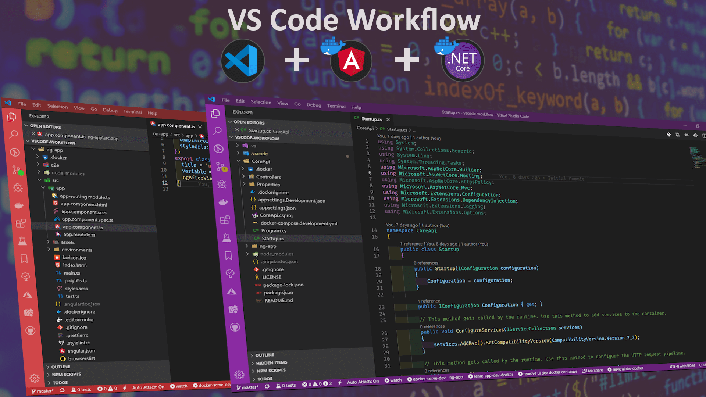
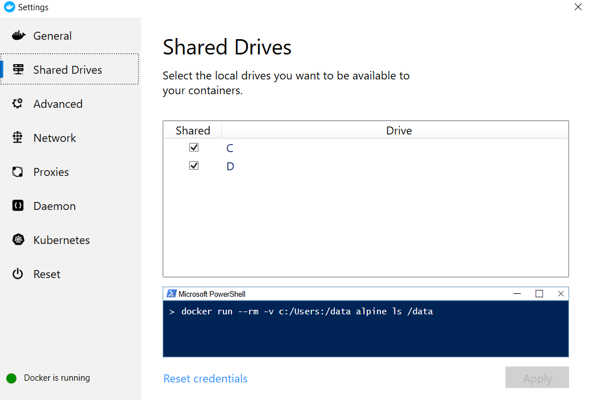

# VSCode-Workflow

Fullstack app to demonstrate end to end workflow of Angular and ASP Net Core app inside VS Code .
This app can be used as a template to kickstart the development of fullstack Angular and Dot Net Core app inside VS Code with the best practices to maintain the readable, maintainable and error free code while keeping the project setup as easy as possible.
The complete project is explained in [this blog post](https://medium.com/@spp020/vs-code-workflow-for-dockerize-asp-net-core-angular-app-c20e427c4a2).

# What You Will Get

1.  Essential VS Code Extensions
2.  Basic Angular-cli and ASP Dot Net Core WebAPI app
3.  Essential VS Code settings to maintain the readable code with the same quality across the team
4.  Essential Typescript, SCSS linting rules with the help of prettier integration with tslint and stylelint
5.  Consistent code styling and formatting across the team with the help of prettier
6.  Git commit message hygiene using Git message linting
7.  Automated pre-commit git hooks, so that no bad code is pushed to the repository
8.  Dockerizing Angular and Dot Net app for both development and production
9.  Live watch debugging Angular and Dot Net app with and without docker
10. Debugging API and UI apps with a single click

## Prerequisits

1.  [VS Code](https://code.visualstudio.com/)
2.  [.NET Core 2.2 SDK and Runtime](https://dotnet.microsoft.com/download/dotnet-core/2.2)
3.  [Node.Js V10.16.0 or higher](https://nodejs.org/en/)
4.  [Angular-cli V8.0.3 or higher](https://cli.angular.io/)
5.  [Docker](https://www.docker.com/)

#### Essential VS Code Extensions

1.  [.NET Core Extension Pack](https://marketplace.visualstudio.com/items?itemName=doggy8088.netcore-extension-pack)
2.  [Prettier - Code formatter](https://marketplace.visualstudio.com/items?itemName=esbenp.prettier-vscode)
3.  [Debugger for Chrome](https://marketplace.visualstudio.com/items?itemName=msjsdiag.debugger-for-chrome)
4.  [.NET Auto Attach](https://marketplace.visualstudio.com/items?itemName=DennisMaxJung.vscode-dotnet-auto-attach)
5.  [TSLint](https://marketplace.visualstudio.com/items?itemName=ms-vscode.vscode-typescript-tslint-plugin)
6.  [Docker](https://marketplace.visualstudio.com/items?itemName=ms-azuretools.vscode-docker)

## Prerequisite for Debugging Inside Docker

The API app when run on port 5001 (https://localhost:5001), requires the dev certificate. This dev certificate will be used by the Docker.
Run following command which will export the certificate to the C:/cert/ folder

    dotnet dev-certs https -v -ep c:\cert\aspnetcore-cert.pfx -p yourpassword

To enable the volumes mouting, make sure you give share permission to docker for the required drive.

## Initial Setup

First run the command `npm i` in the root folder (vscode-workflow) and then restart the command line. Now, run the command `npm run setup` again in the root folder. The command will setup everything required to run the app with or without Docker for the first time:

- Install Angular packages
- Install .Net packages
- Build UI app docker image for development environment
- Build UI app docker image for production environment
- Build API app docker image for development environment
- Build API app docker image for production environment

## Utility Scripts

`setup` : Installs the API and UI app packages, builds the API and UI packages for the dev and prod environments.
`serve-ui-dev-local`: Serves the Angular app in the development mode.
`serve-api-dev-local`: Serves the .NetCore app in the development mode.
`serve-app-dev-local`: Serves the Angular and .NetCore app in the development mode.
`serve-ui-dev-docker`: Serves the Angular app using the Docker Container in development mode.
`serve-api-dev-docker`: Serves the .NetCore app using the Docker Container in development mode.
`serve-app-dev-docker`: Serves the Angular and .NetCore app using the Docker Container in development mode.

## Commit Lint

The app is configured with a commit message lint which runs on the stagged files before commit. For lining [conventional-changelog/commitlint](https://github.com/conventional-changelog/commitlint) package is used.

Common types according to [commitlint-config-conventional (based on the the Angular convention)](https://github.com/conventional-changelog/commitlint/tree/master/@commitlint/config-conventional#type-enum) can be:

- build
- ci
- chore
- docs
- feat
- fix
- perf
- refactor
- revert
- style
- test
